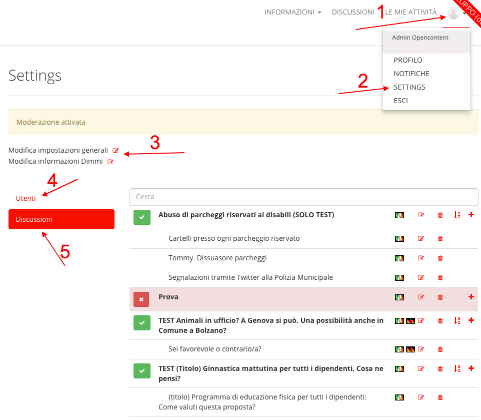
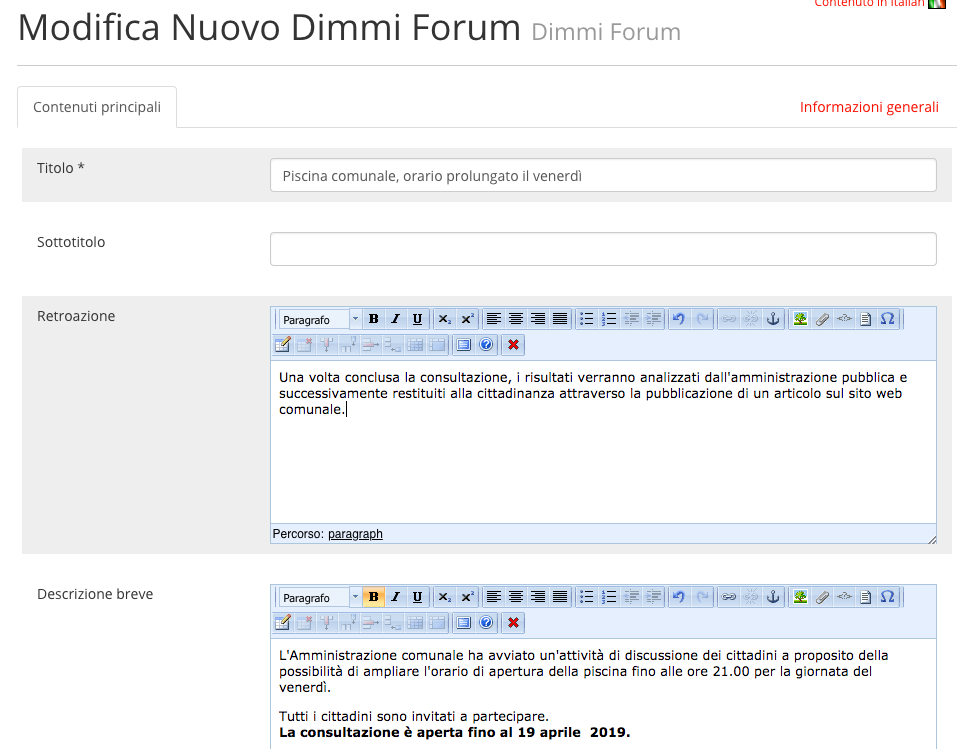
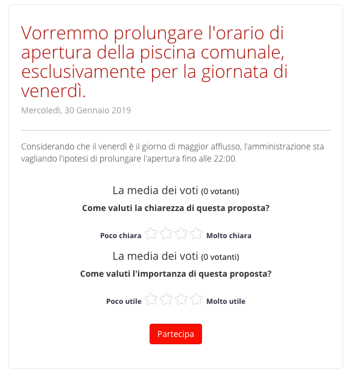
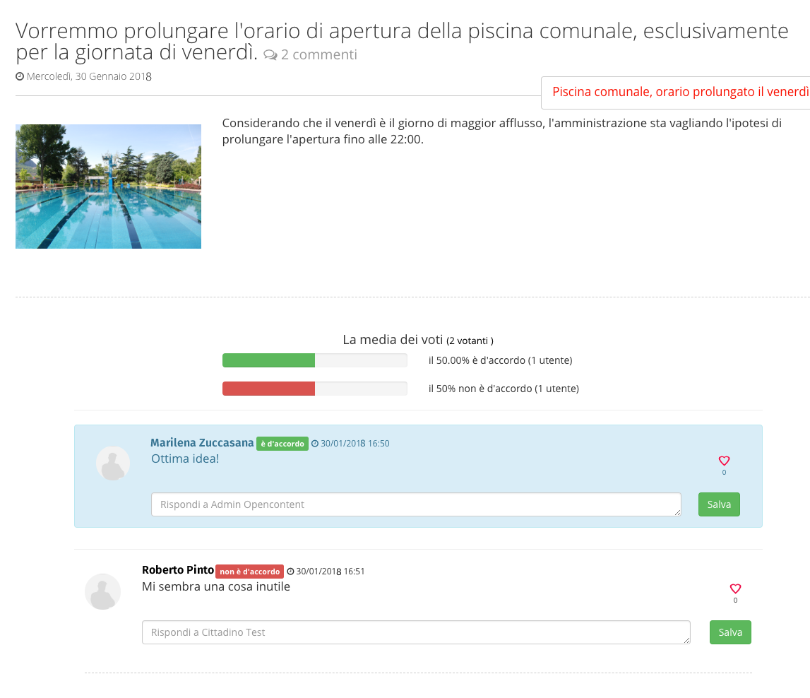

.. _h6b46296a11517f234f77793450f4347:

Manuale OpenConsultazioni
*************************

.. _h63227f65484e5af3bb80471587d6f:

Funzionamento tipico
====================

L’utente amministratore (interno all’ente) crea una nuova consultazione con gli argomenti sui quali intende sollecitare la discussione. Non appena la consultazione viene resa pubblica, i cittadini sono liberi di entrare (previa registrazione) e inserire i propri commenti. Alla data di chiusura, non è più possibile inserire ulteriori commenti. L’amministrazione estrae i dati per valutare i risultati.

.. _h83a52792f5e357e7a47a1a437f32:

Gestione del sistema
====================

I contenuti che l’amministratore dell’applicazione si trova a gestire sono le consultazioni. Una consultazione è definita da una struttura che si articola su tre livelli: 

* Discussione (Forum)

* Topic

* Commenti. 

Esempio:

\ |STYLE0|\ 

* Sei favorevole a prolungare di venerdì l'orario della piscina comunale fino alle ore 22:00? Perché? (Topic) 

    * Commento

    * Commento 2

    * …

    * Commento n				

* Sei contrario a prolungare l'orario di venerdì della piscina comunale? Esprimi la tua opinione! (Topic)

    * Commento 3

    * …

    * Commento x

* Se hai una nuova proposta inerente all'orario, ti invitiamo a segnalarcela (Topic)

    * Commento 5

    * Commento 6

    * …

    * Commento k

L’analisi sulla consultazione è di tipo \ |STYLE1|\ : i commenti inseriti dai cittadini vanno perciò letti ed analizzati nel merito. 

Il sistema consente anche di attivare una sorta di “voto” a livello di topic e a livello di commento, il che lo rende adattabile alle diverse casistiche che potrebbe essere necessario affrontare. Bisogna però ragionare sulla struttura delle discussioni (utilizzando i vari strumenti a disposizione) in base al tipo di feedback che si vuole raccogliere.

.. _h6e4d39105a64461f4f3377d353919:

Accesso al sistema
------------------

Per accedere al sistema, è necessario selezionare la voce “accedi” dal menu principale.

\ |IMG1|\ 

I cittadini che vogliono accedere per esprimere la propria opinione devono prima registrarsi attraverso l’apposito form di registrazione.

.. _h6d232b5d1d51461e614d1d413c4578b:

Funzionalità del sistema
------------------------

Per accedere all’area di gestione, è necessario (dopo aver effettuato l’accesso), aprire il menu utente (1), e selezionare “Settings” (2).

\ |IMG2|\ 

Da qui è possibile modificare le impostazioni generali dell’applicazione (3), gestire gli utenti registrati al sito (4) e vedere la lista delle discussioni (5). Nella lista, l’icona verde indica che si tratta di una discussione aperta (visibile al pubblico), cliccando è possibile nasconderla temporaneamente. 

Sulla destra sono presenti i tasti per modificare e cancellare la discussione, ordinare i Topic, aggiungere un nuovo Topic.

Nelle impostazioni generali è presente un checkbox “abilita moderazione”.

.. _h922257f2a3d4481d5c30126f686b52:

Creazione di una nuova Discussione
----------------------------------

In fondo alla lista si trova il pulsante “Aggiungi Discussione”. Con quel tasto si accede all’interfaccia di creazione di una nuova discussione:

\ |IMG3|\ 

I dati da inserire sono il titolo, una breve descrizione, eventualmente una immagine, e la cosiddetta “retroazione”, ovvero una indicazione di quello che accadrà dopo che la consultazione si sarà conclusa.

.. _h58202b544135c715f6f12354b7a60:

Aggiunta dei Topic
------------------

Dalla lista delle discussioni, cliccando il pulsante “+” si avvia la creazione di un nuovo Topic “figlio” della discussione.

\ |IMG4|\ 

Oltre al titolo e a una breve descrizione, per ogni Topic sono attivi due “sistemi di votazione” (Votazione 1 e Votazione 2) configurabili a seconda delle esigenze. Se non vengono esplicitamente disabilitati, essi vengono proposti come un voto sulla chiarezza e sull’importanza della proposta.

\ |IMG5|\ 

All’interno del Topic è possibile anche definire se si chiede ai cittadini, insieme al commento, anche un “voto” esplicito (“sei d’accordo” con risposta “si” o “no”). Non è consigliabile mescolare le varie tipologie di votazione (a livello di topic e a livello di commento) per evitare confusione, ma la possibilità di attivarle consente di avere degli utili strumenti per coprire le varie casistiche di consultazione da sottoporre alla cittadinanza.

Supponendo ad esempio di inserire un solo topic, disattivando le votazioni sui topic e attivando quelle sui commenti, si potrebbe arrivare a un risultato come quello in figura (dettaglio delle discussione). Viene mostrato il topic, con le percentuali di preferenza per il sì o per il no.

In questo modo si riesce a fare una rapida analisi quantitativa, semplicemente verificando il numero di favorevoli e di contrari. 

\ |IMG6|\ 

.. bottom of content

.. |STYLE0| replace:: **Piscina comunale: proposta di orario prolungato nella giornata di venerdì (Forum)**

.. |STYLE1| replace:: **qualitativo**

